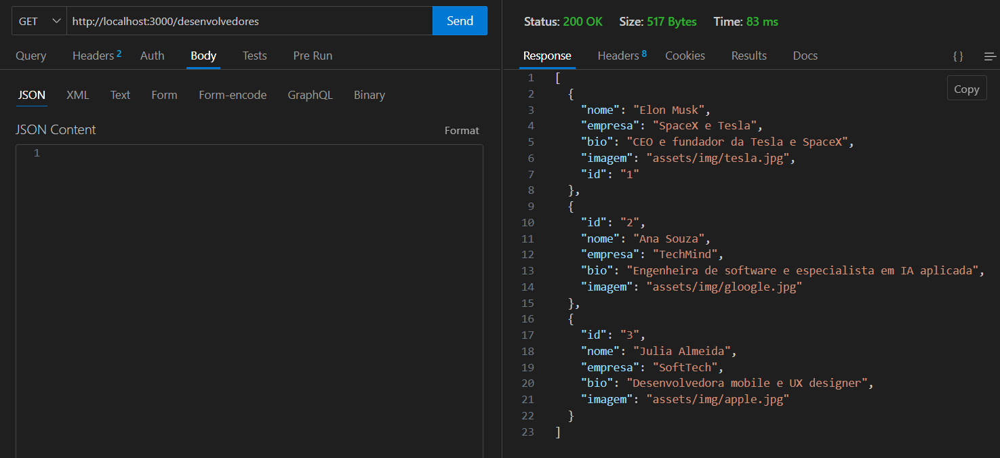
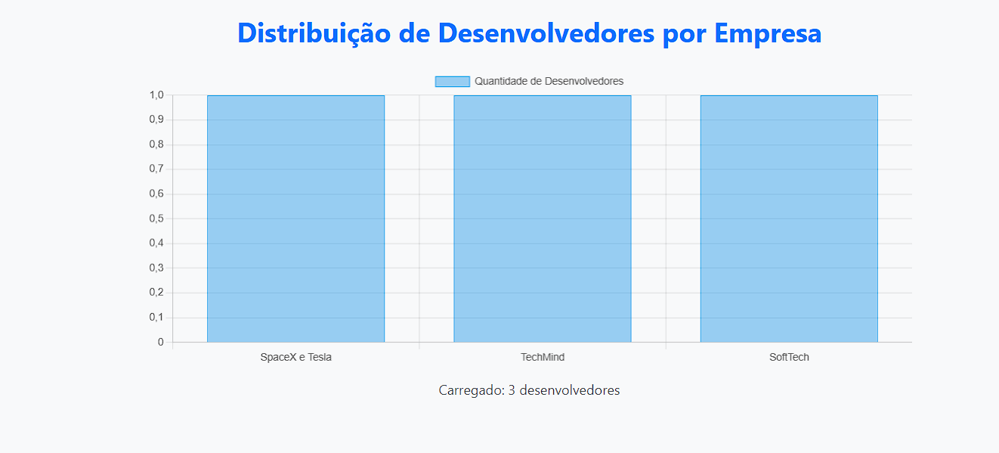
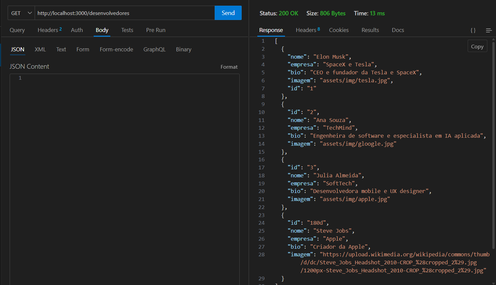
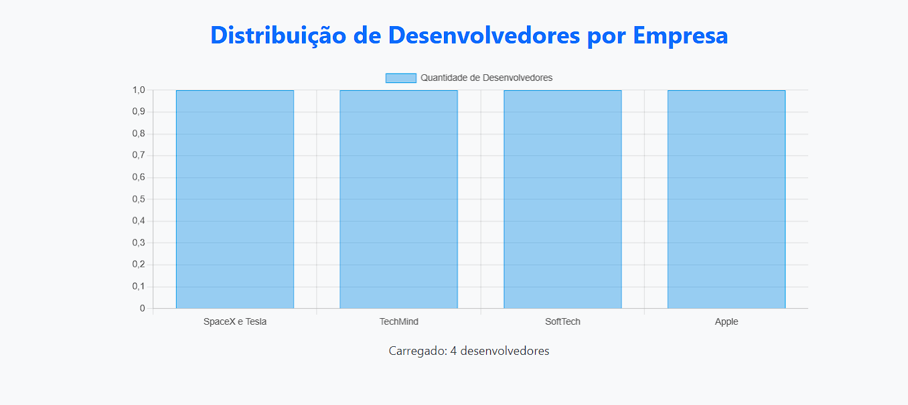

# Trabalho Prático 07 - Semanas 13 e 14

A partir dos dados cadastrados na etapa anterior, vamos trabalhar formas de apresentação que representem de forma clara e interativa as informações do seu projeto. Você poderá usar gráficos (barra, linha, pizza), mapas, calendários ou outras formas de visualização. Seu desafio é entregar uma página Web que organize, processe e exiba os dados de forma compreensível e esteticamente agradável.

Com base nos tipos de projetos escohidos, você deve propor **visualizações que estimulem a interpretação, agrupamento e exibição criativa dos dados**, trabalhando tanto a lógica quanto o design da aplicação.

Sugerimos o uso das seguintes ferramentas acessíveis: [FullCalendar](https://fullcalendar.io/), [Chart.js](https://www.chartjs.org/), [Mapbox](https://docs.mapbox.com/api/), para citar algumas.

## Informações do trabalho

- Nome: Carlos Daniel Tempo Dutra
- Matricula: 904101
- Proposta de projeto escolhida: Pessoas e Produções
- Breve descrição sobre seu projeto:

O projeto “Grandes Desenvolvedores & Seus Projetos” é uma plataforma criada para reunir e destacar os principais nomes do mundo da tecnologia e suas contribuições, ao mesmo tempo em que abre espaço para que qualquer usuário possa compartilhar suas próprias criações.
A ideia é unir inspiração e colaboração: de um lado, apresentamos desenvolvedores de destaque, suas histórias e projetos que marcaram a evolução tecnológica; de outro, oferecemos um ambiente interativo para que novos talentos possam cadastrar e divulgar suas próprias soluções.

O projeto tem como propósito valorizar a criatividade, promover conhecimento e criar conexões entre grandes nomes da tecnologia e novos criadores que estão surgindo.

**Print da tela com a implementação**

<< Nesta etapa foi criada uma nova página dedicada à apresentação dinâmica dos dados utilizando a biblioteca Chart.js (ou FullCalendar / Mapbox — coloque a que você usou).
A página foi conectada ao JSON Server, permitindo que o gráfico/calendário seja atualizado automaticamente conforme os dados são manipulados pelas operações de CRUD implementadas anteriormente.

Foi adicionada uma integração que busca os desenvolvedores no db.json e exibe as informações de forma visual.
Também foram realizados testes práticos, cadastrando e atualizando registros para demonstrar o funcionamento dinâmico. Foram incluídos dois prints no README mostrando os dados diferentes sendo refletidos na apresentação dinâmica. >>

<<   >>
<<  >>

<<  >>
<<  >>
